#### **Request Headers** 공통사항

| Name | Value / Type | Required | Description |
| :--- | :--- | :---: | :--- |
| `Authorization` | `JWT(AccessToken/RefreshToken), Cookie` | ✅ | API 접근을 위한 인증 토큰 |
| `Accept` | `application/json` | ✅ | 응답받을 데이터 형식 지정 |


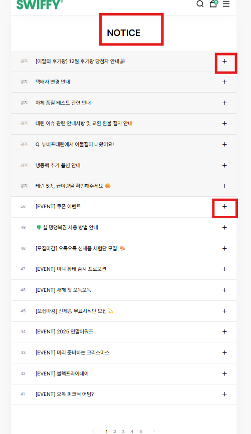

#### **Request Parameters**

| Name | Type | Required | Description |
| :--- | :--- | :---: | :--- |
| productId | - | - | - |
상세내역
```
이미지 카드
상품 Url ( 제품 조회 버튼 )
쿠폰 받기 버튼
```

Res
```
게시물 검색 ( 기간 / 필터 (제목 내용) / 검색어 )
```

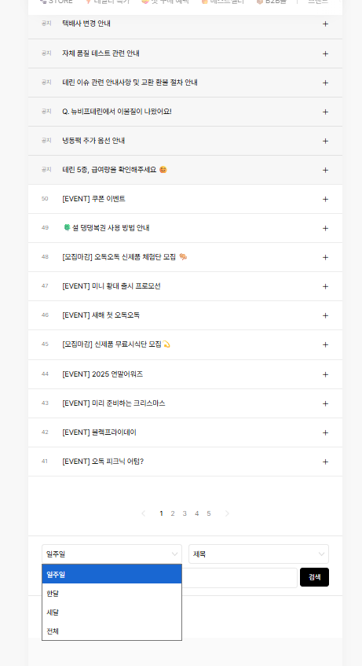
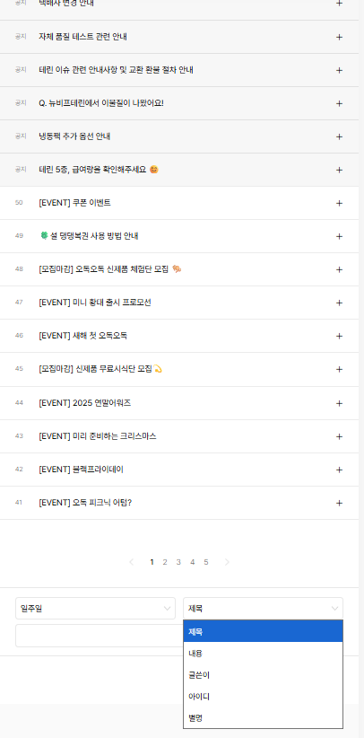
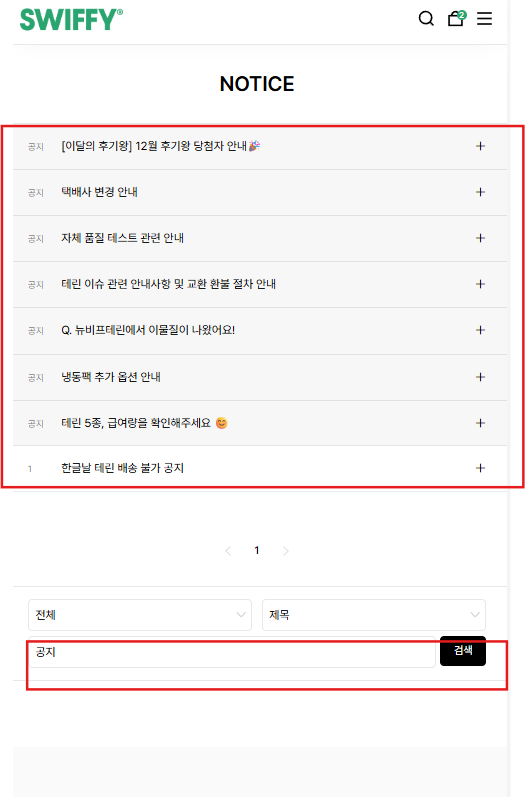

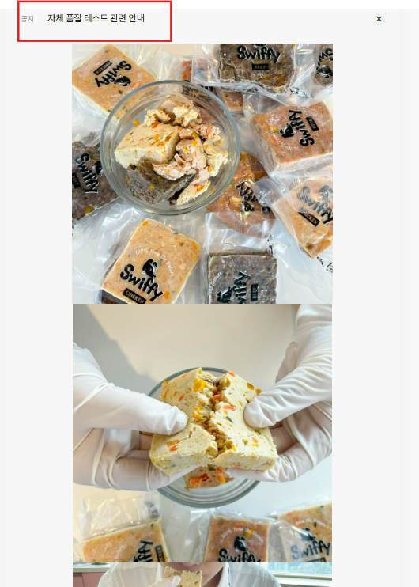
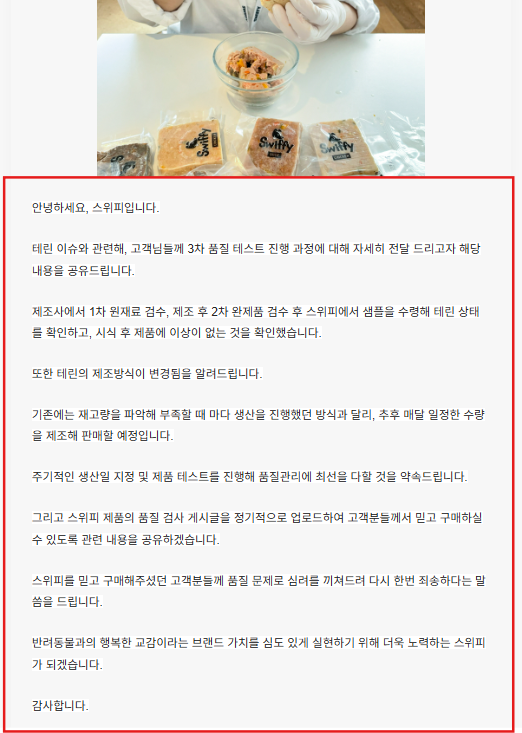
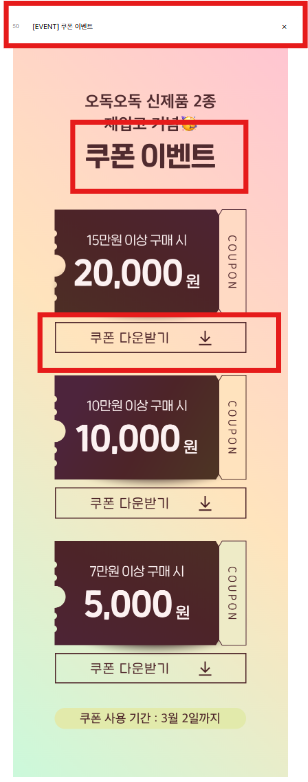
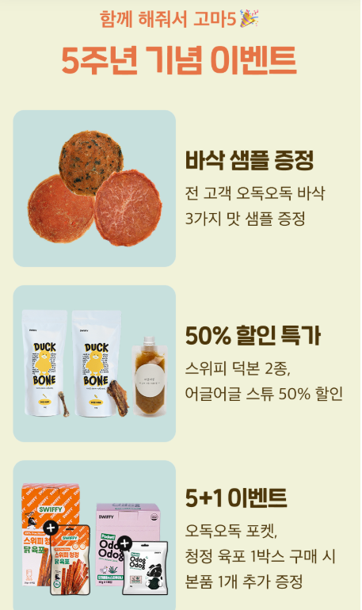
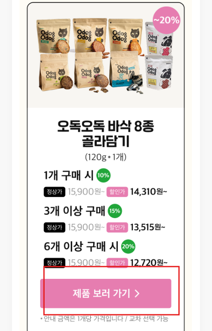
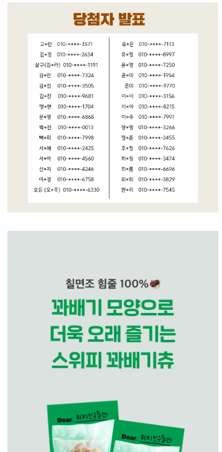
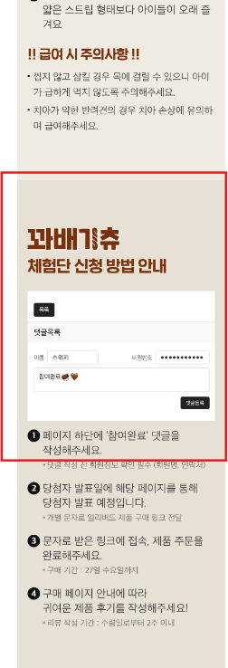
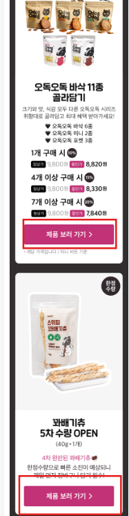
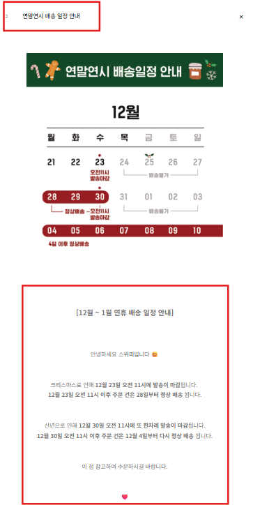
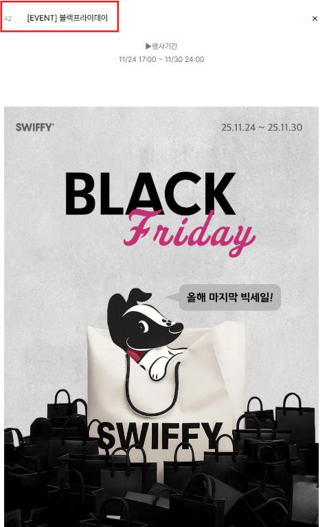
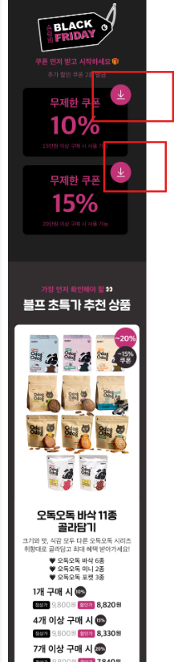


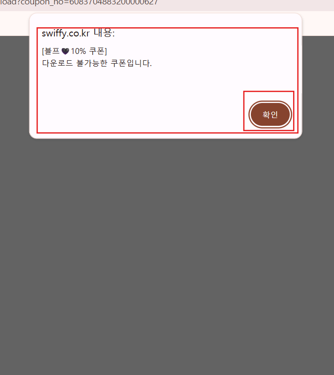
