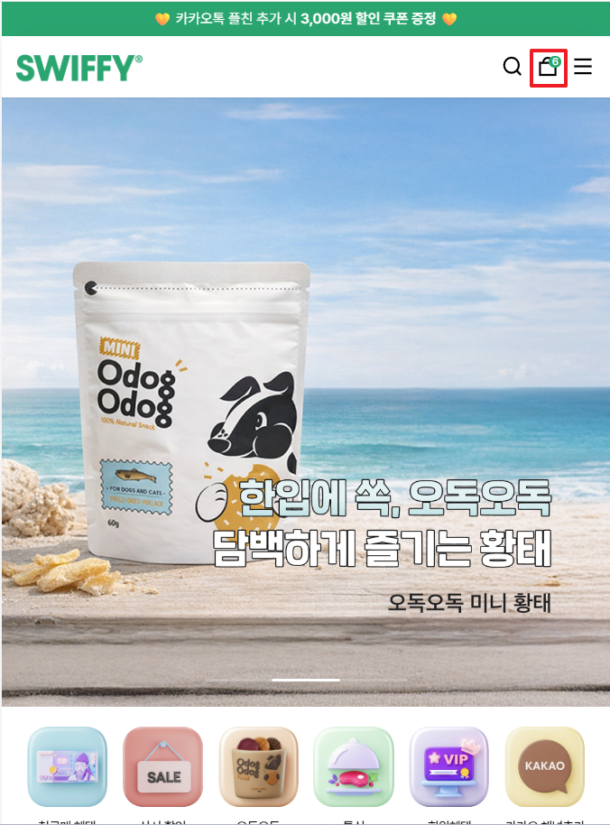
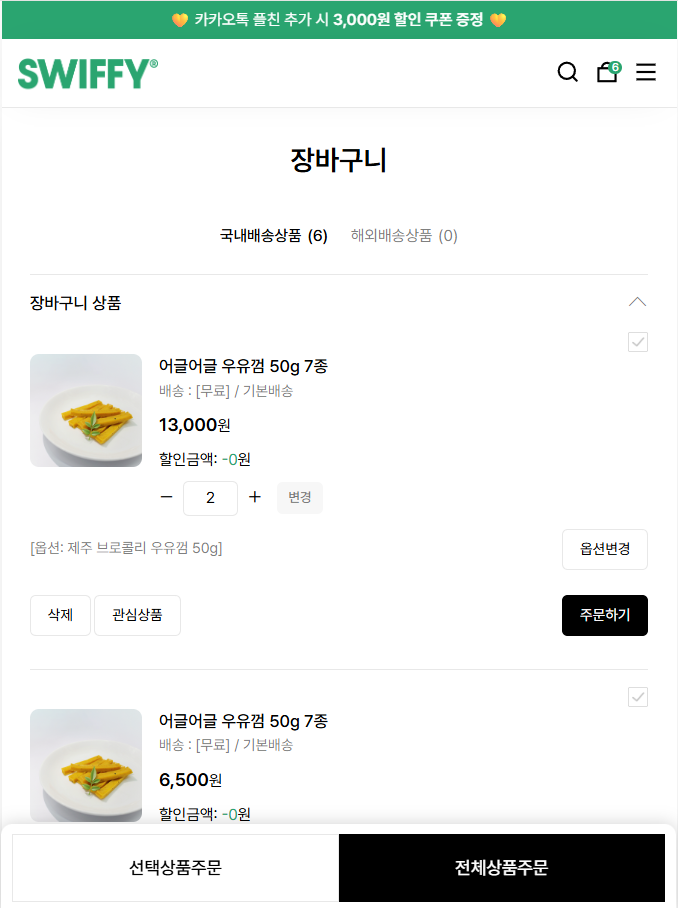
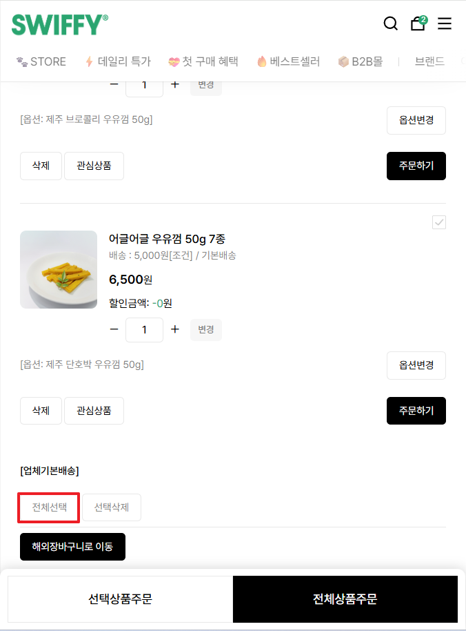
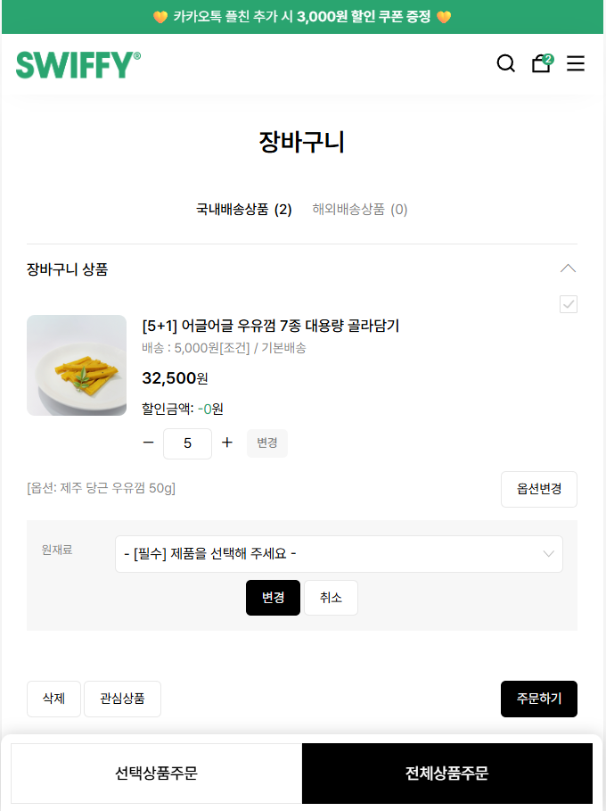
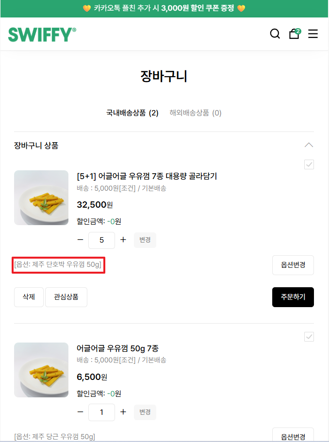
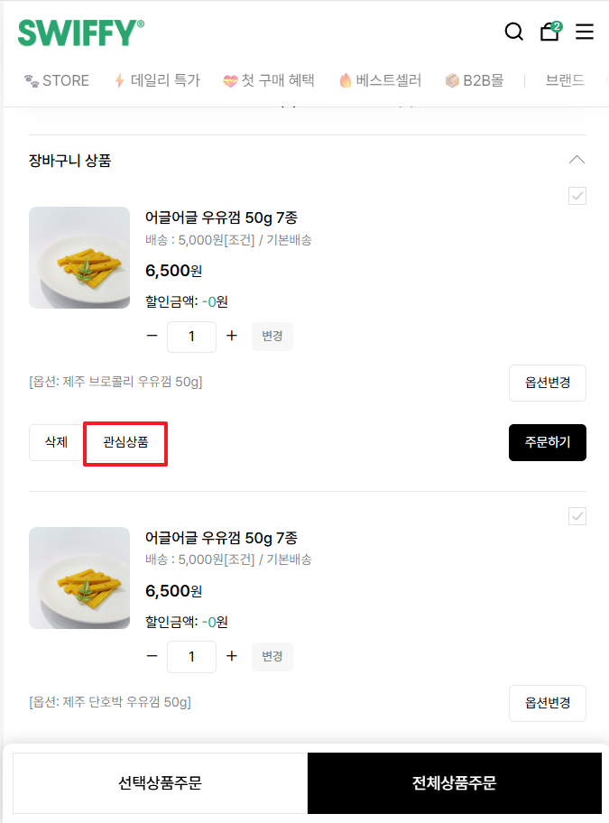
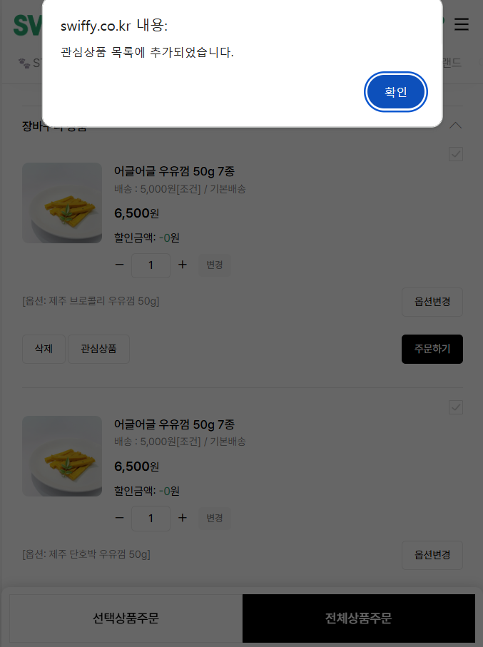
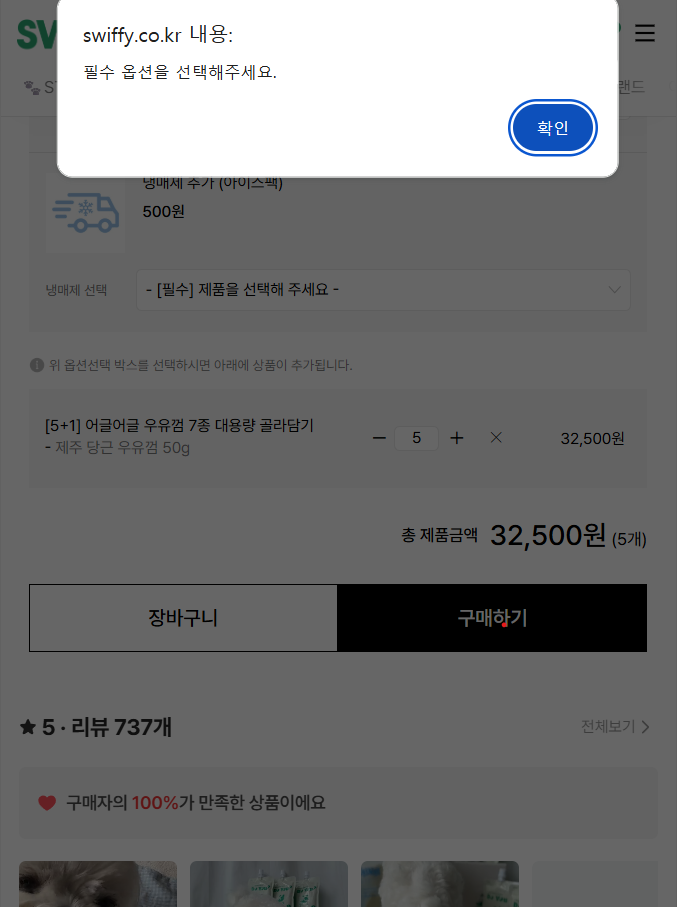

#### **Request Headers** 공통사항

| Name | Value / Type | Required | Description |
| :--- | :--- | :---: | :--- |
| `Authorization` | `JWT(AccessToken/RefreshToken), Cookie` | ✅ | API 접근을 위한 인증 토큰 |
| `Accept` | `application/json` | ✅ | 응답받을 데이터 형식 지정 |




---

#### **Request Parameters**

| Name | Type | Required | Description |
| :--- | :--- | :---: | :--- |
| productId | Long | Y | 상품 고유 번호 |

#### **Request Body**
```json
{
  "productId": 202,
  "optionName": "제주 당근 우유 껌 50g",
  "count": 1
}
```

#### **Success Response**

* **Code:** 200 OK
* **Content:**

```json
{
  "status": "success",
  "data": {
    "imageUrl": "https://swiffy.com/items/milk_gum_carrot.png",
    "productName": "어글어글 우유껌 50g 7종",
    "option": "제주 당근 우유 껌 50g",
    "buyUrl": "/order/checkout",
    "cartUrl": "/order/cart",
    "continueShoppingUrl": "/products/list"
  }
}
```

#### **Error Response**

  * **Code:** 404 NOT FOUND
  * **Content:** `{ "message": "User not found" }`
  * **Code:** 401 UNAUTHORIZED
  * **Content:** `{ "message": "Invalid token" }`

#### **참고사항**



---

## 엔드포인트 상세
**GET** `/api/v1/cart`

---

#### **Request Parameters**

| Name | Type | Required | Description |
| :--- | :--- | :---: | :--- |
| - | - | - | - |

#### **Request Body**
```json
{
  "cartId": ""
}
```

#### **Success Response**

  * **Code:** 200 OK
  * **Content:**

```json
{
  "status": "success",
  "data": [
    {
      "cartItemId": 1,
      "productName": "어글어글 우유껌 50g 7종",
      "option": "제주 브로콜리 우유껌 50g",
      "price": 13000,
      "discountPrice": 0,
      "count": 2,
      "imageUrl": "https://swiffy.com/items/broccoli_gum.png",
      "deleteUrl": "/api/cart/1",
      "wishlistUrl": "/api/wishlist/1",
      "orderUrl": "/api/order/1"
    },
    {
      "cartItemId": 2,
      "productName": "어글어글 우유껌 50g 7종",
      "option": null,
      "price": 6500,
      "discountPrice": 0,
      "count": 1,
      "imageUrl": "https://swiffy.com/items/original_gum.png",
      "deleteUrl": "/api/cart/2",
      "wishlistUrl": "/api/wishlist/2",
      "orderUrl": "/api/order/2"
    }
  ]
}
```

#### **Error Response**

   * **Code:** 404 NOT FOUND
  * **Content:** `{ "message": "User not found" }`
  * **Code:** 401 UNAUTHORIZED
  * **Content:** `{ "message": "Invalid token" }`

#### **참고사항**

---


---

## 엔드포인트 상세
**GET** `/api/v1/cart/summary`

---

#### **Request Parameters**

| Name | Type | Required | Description |
| :--- | :--- | :---: | :--- |
| - | - | - | - |

#### **Request Body**
```json
{
  "cartId": ""
}
```

#### **Success Response**

  * **Code:** 200 OK
  * **Content:**

```json
{
  "status": "success",
  "data": {
    "totalProductPrice": 13000,
    "totalShippingFee": 5000,
    "estimatedPaymentAmount": 18000,
    "estimatedRewardPoints": 130,
    "memberRewardPoints": 130,
    "selectAll": "/api/v1/cart/select-all",
    "deleteSelected": "/api/v1/cart/items/delete",
    "moveToOverseasCart": "/api/v1/cart/overseas",
    "orderSelected": "/api/v1/orders/selected",
    "orderAll": "/api/v1/orders/all"
  }
}
```

#### **Error Response**

  * **Code:** 404 NOT FOUND
  * **Content:** `{ "message": "User not found" }`
  * **Code:** 401 UNAUTHORIZED
  * **Content:** `{ "message": "Invalid token" }`

#### **참고사항**

---



---

## 엔드포인트 상세
**PUT** `/api/v1/cart/select-all`

---

#### **Request Parameters**

| Name | Type | Required | Description |
| :--- | :--- | :---: | :--- |
| - | - | - | - |

#### **Request Body**
```json
{
  "isSelectedAll": true
}
```

#### **Success Response**

  * **Code:** 200 OK
  * **Content:**

```json
{
  "status": "success",
  "data": {
    "isSelectedAll": true,
  }
}
```

#### **Error Response**

  * **Code:** 404 NOT FOUND
  * **Content:** `{ "message": "User not found" }`
  * **Code:** 401 UNAUTHORIZED
  * **Content:** `{ "message": "Invalid token" }`

#### **참고사항**

---


---

## 엔드포인트 상세
**PUT** `/api/v1/cart/{cartItemId}/select`

---

#### **Request Parameters**

| Name | Type | Required | Description |
| :--- | :--- | :---: | :--- |
| cartItemId | Long | Y | 선택 상태를 변경할 장바구니 아이템의 고유 번호 |

#### **Request Body**
```json
{
  "isSelected": true
}
```

#### **Success Response**

  * **Code:** 200 OK
  * **Content:**

```json
{
  "status": "success",
  "data": {
    "cartItemId": 2,
    "isSelected": true,
    "selectedItemCount": 1
  }
}
```

#### **Error Response**

  * **Code:** 404 NOT FOUND
  * **Content:** `{ "message": "User not found" }`
  * **Code:** 401 UNAUTHORIZED
  * **Content:** `{ "message": "Invalid token" }`

#### **참고사항**
* `productId` 대신 장바구니 고유 번호인 `cartItemId`를 사용하여 특정 행(Row)의 선택 상태를 명확히 지정했습니다.

---


---

## 엔드포인트 상세
**DELETE** `/api/v1/cart/items`

---

#### **Request Parameters**

| Name | Type | Required | Description |
| :--- | :--- | :---: | :--- |
| - | - | - | - |

#### **Request Body**
```json
{
  "cartItemIds": [1, 2, 5]
}
```

#### **Success Response**

* **Code:** 200 OK
* **Content:**

```json
{
  "status": "success",
  "message": "선택한 상품이 삭제되었습니다.",
  "data": {
    "deletedCount": 3,
    "remainingItemCount": 3,
    "totalOrderPrice": 0
  }
}
```

#### **Error Response**

  * **Code:** 404 NOT FOUND
  * **Content:** `{ "message": "User not found" }`
  * **Code:** 401 UNAUTHORIZED
  * **Content:** `{ "message": "Invalid token" }`

---

#### **참고사항**
* **다중 삭제**: 사용자가 선택한 여러 개의 `cartItemId`를 배열(`[]`)에 담아 한 번에 삭제 처리합니다.
* **응답 데이터**: 삭제 후 남아있는 상품 개수(`remainingItemCount`)와 갱신된 결제 예정 금액을 응답하여 화면이 즉시 업데이트되도록 설계했습니다.

---




---

## 엔드포인트 상세
**PUT** `/api/v1/cart/{cartItemId}/option`

---

#### **Request Parameters**

| Name | Type | Required | Description |
| :--- | :--- | :---: | :--- |
| cartItemId | Long | Y | 옵션을 변경할 장바구니 항목 ID |

#### **Request Body**
```json
{
  "optionName": "제주 당근 우유껌 50g",
  "count": 5
}
```

#### **Success Response**

* **Code:** 200 OK
* **Content:**

```json
{
  "status": "success",
  "message": "옵션이 변경되었습니다.",
  "data": {
    "cartItemId": 105,
    "productName": "[5+1] 어글어글 우유껌 7종 대용량 골라담기",
    "updatedOption": "제주 당근 우유껌 50g",
    "updatedCount": 5,
    "totalPrice": 32500
  }
}
```

#### **Error Response**

  * **Code:** 404 NOT FOUND
  * **Content:** `{ "message": "User not found" }`
  * **Code:** 401 UNAUTHORIZED
  * **Content:** `{ "message": "Invalid token" }`

---

#### **참고사항**
* **옵션 데이터**: 사진 속의 **"-[필수] 제품을 선택해 주세요-"** 드롭다운에서 사용자가 선택한 값을 `optionName`으로 전달합니다.
* **데이터 동기화**: 옵션이 바뀌면 가격이 변동될 수 있으므로, 응답값(`data`)에 갱신된 **`totalPrice`**를 포함하여 화면에 즉시 반영되도록 설계했습니다.


네, 정확합니다! 여섯 번째 사진은 **'옵션변경'** 버튼을 눌러 나타난 레이어 안에서, 사용자가 구체적인 상품 종류를 선택하기 위해 **드롭다운(Select Box)을 펼친 상태**를 보여주고 있네요.

API 설계 관점에서 보면, 이 화면은 **"이 상품이 가질 수 있는 옵션 리스트"**를 서버에서 받아와서 보여주는 과정이 필요합니다. 이를 위해 새로운 조회 API 양식을 하나 더 추가하면 완벽할 것 같아요.

---

## 엔드포인트 상세
**GET** `/api/v1/products/{productId}/options`

---

#### **Request Parameters**

| Name | Type | Required | Description |
| :--- | :--- | :---: | :--- |
| productId | Long | Y | 옵션 목록을 가져올 상품 고유 번호 |

#### **Request Body**
```json
```

#### **Success Response**

* **Code:** 200 OK
* **Content:**

```json
{
  "status": "success",
  "data": [
    { "optionId": 1, "optionName": "제주 당근 우유껌 50g", "extraPrice": 0, "stockStatus": "AVAILABLE" },
    { "optionId": 2, "optionName": "제주 단호박 우유껌 50g", "extraPrice": 0, "stockStatus": "AVAILABLE" },
    { "optionId": 3, "optionName": "제주 블루베리 우유껌 50g", "extraPrice": 1000, "stockStatus": "AVAILABLE" },
    { "optionId": 4, "optionName": "해외 크랜베리 우유껌 50g", "extraPrice": 1000, "stockStatus": "SOLDOUT" }
  ]
}
```

#### **Error Response**
  * **Code:** 404 NOT FOUND
  * **Content:** `{ "message": "User not found" }`
  * **Code:** 401 UNAUTHORIZED
  * **Content:** `{ "message": "Invalid token" }`
---

#### **참고사항**
* **드롭다운 구성**: 사진 속 파란색으로 하이라이트 된 **'제주 단호박 우유껌 50g'**처럼 사용자가 선택할 수 있는 목록을 제공합니다.
* **추가 금액**: '제주 블루베리(+1,000원)'처럼 옵션에 따라 추가되는 금액(`extraPrice`) 정보를 함께 내려주어 프론트엔드에서 표시할 수 있게 합니다.
* **품절 상태**: '해외 크랜베리(품절)'처럼 `stockStatus` 값을 활용해 드롭다운에서 선택 불가능하게(disabled) 처리할 수 있습니다.

---




---

## 엔드포인트 상세
**GET** `/api/v1/cart`

---

#### **Success Response (일부)**

```json
{
  "status": "success",
  "data": [
    {
      "cartItemId": 105,
      "productName": "[5+1] 어글어글 우유껌 7종 대용량 골라담기",
      "selectedOption": "제주 단호박 우유껌 50g", // 사진 속 빨간 박스에 들어가는 값
      "price": 32500,
      "count": 5,
      "imageUrl": "https://swiffy.com/items/milk_gum_large.png"
    }
  ]
}
```

#### **참고 사항**
* **selectedOption**: 사용자가 방금 드롭다운에서 고른 '제주 단호박 우유껌 50g'이라는 텍스트가 이 필드에 담겨와야 합니다.

---



---

## 엔드포인트 상세
**POST** `/api/v1/wishlist`  
**PUT** `/api/v1/cart/{cartItemID}/quantity`  

위 quantity는 수량 옆에 있는 변경 (수량변경)  엔드포인트
---

#### **Request Parameters**

| Name | Type | Required | Description |
| :--- | :--- | :---: | :--- |
| - | - | - | - |

#### **Request Body**
```json
{
  "productId": 202,
  "cartItemId": 105
}
```

#### **Success Response**

* **Code:** 201 CREATED
* **Content:**

```json
{
  "status": "success",
  "message": "관심상품에 등록되었습니다.",
  "data": {
    "wishlistId": 501,
    "productName": "어글어글 우유껌 50g 7종"
  }
}
```

#### **Error Response**

  * **Code:** 404 NOT FOUND
  * **Content:** `{ "message": "User not found" }`
  * **Code:** 401 UNAUTHORIZED
  * **Content:** `{ "message": "Invalid token" }`

---

#### **참고사항**

---




