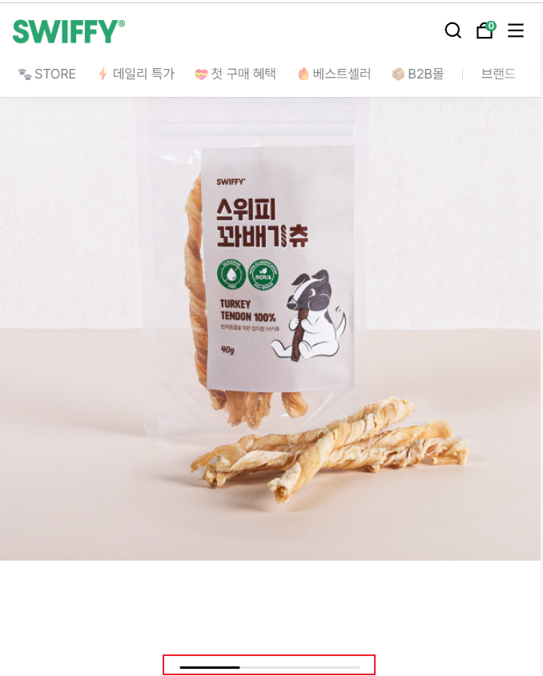
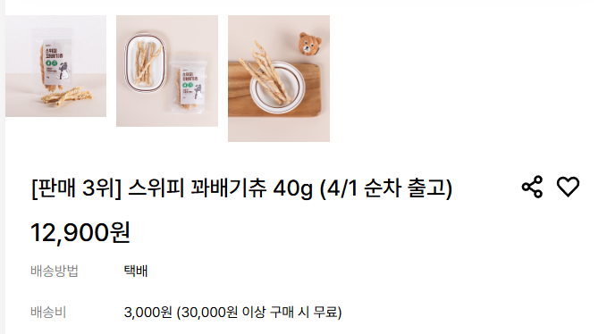
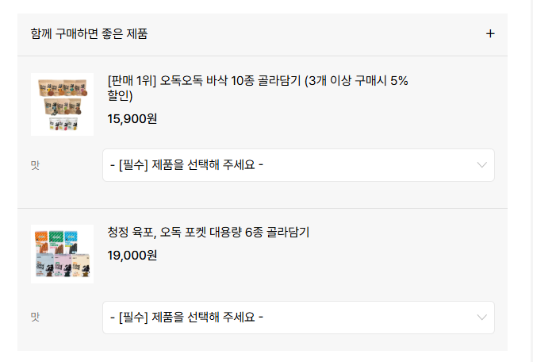
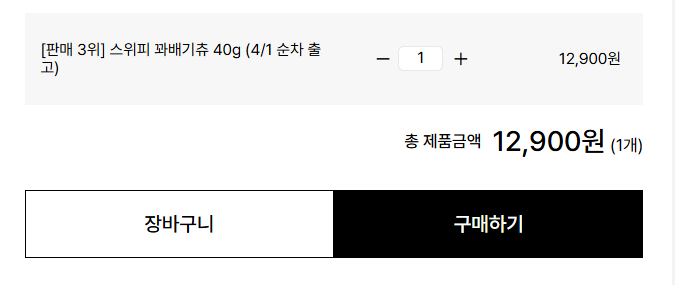
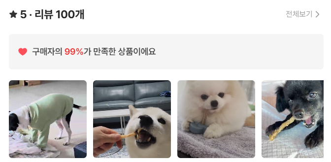
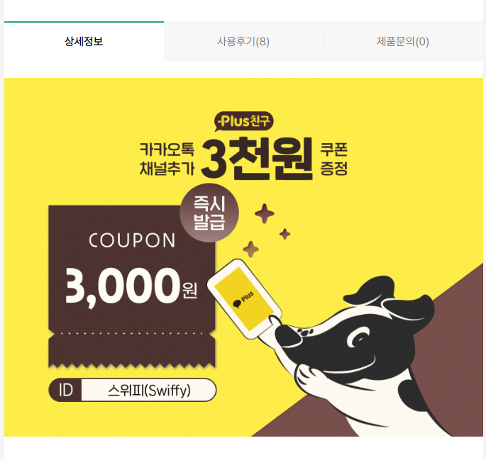
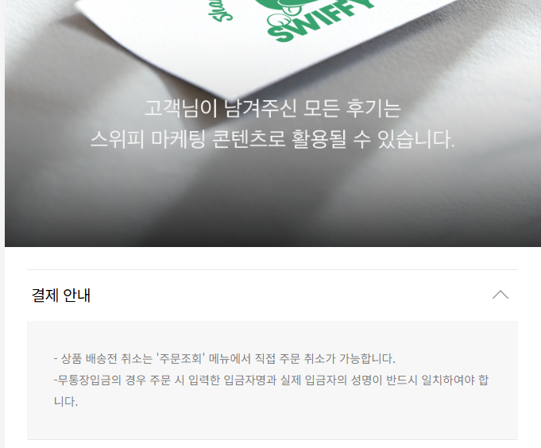
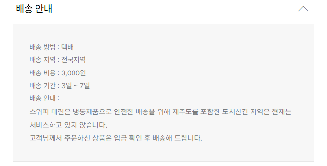
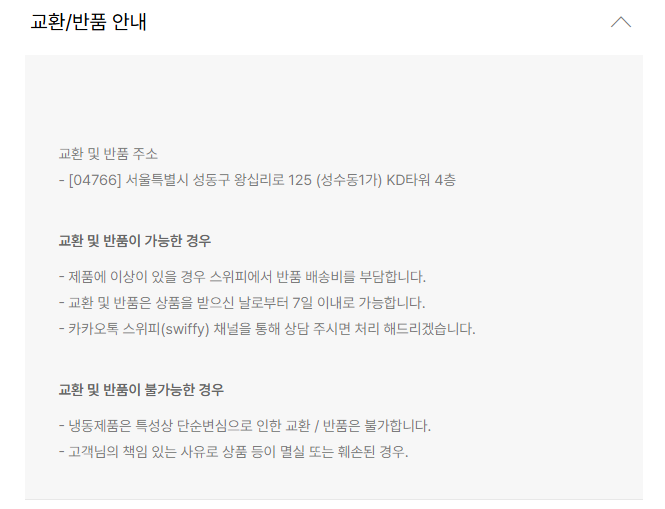
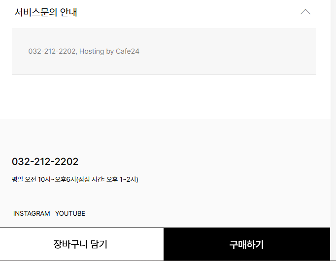

## 1



```
ImageUrl
```

## 2



```
ImageUrl
배송방법
배송비
```

## 3



```
title
price
추천상품 (정보 3개)
- 이름
- 가격
- 옵션(상품 개수 1개, 2개, 4개, 6개, 10개 가격)
- ImageUrl
```

## 4



res
```
- 상품개수
- 옵션
- 상품Id
```


## 5




## 6




## 7



```
상세정보
- 이미지카드Url
```

## 8



## 9



## 10



## 결제 안내, 배송 안내, 교환/반품 안내, 서비스문의 안내는 텍스트로 backend가 뿌리는 것으로 결정

* 이런 제품은 어때요
1. 이미지
2. 제목
3. 가격
4. 제품3개 뿌리는 것으로 결정

